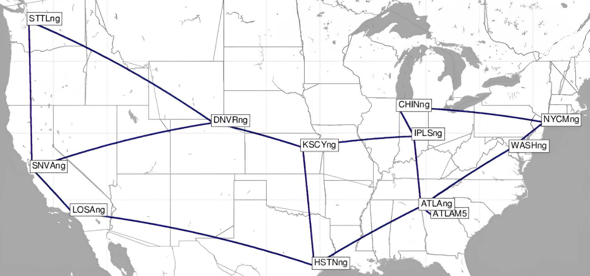

# SyntheticTrafficRouting
This project focuses on generating synthetic network traffic data and evaluating its reliability for network routing tasks, particularly traffic flow management. The project demonstrates the application of **Generative Adversarial Networks (GANs)** and **Conditional Tabular Generative Adversarial Networks (CTGANs)** to generate synthetic datasets and assess key metrics such as total link load on the shortest paths and the distribution of traffic across the network. 


## Overview
Efficient network traffic management relies on accurate simulations of traffic behavior. Generating synthetic traffic matrices is crucial when real traffic data is scarce, sensitive, or limited. In this project, we utilize GANs and CTGANs to generate realistic traffic matrices for the **US Abilene network topology**:
<p align="center">
  
</p>

The generated synthetic data is evaluated for its reliability in simulating real-world conditions by measuring key metrics such as:
- Statistical similarity to real data.
- Link load across shortest paths.
- Distribution of traffic demands.


This repository provides the code for:
- Training GANs and CTGANs on traffic data.
- Evaluating generated traffic matrices using statistical similarity and network performance metrics.


## Installation and Requirements
The following libraries are required to run the code:
- Python 3.8+
- pandas
- matplotlib
- seaborn
- matplotlib 
- scikit-learn
- SDV

You have two options to use the project:
1. Clone the repository and install the required libraries:
```
git clone https://github.com/username/SyntheticTrafficRouting.git
cd SyntheticTrafficRouting
```

2. Use Google Colab: Each notebook in the repository includes a "Colab" button that allows you to open and run the notebook directly in Google Colab without local setup.


## Dataset
The code utilizes real-world traffic matrices from the publicly available the Survivable Network Design Library ([SNDlib](https://sndlib.put.poznan.pl/)). The dataset contains traffic matrices recorded at 5-minute intervals over a 6-month period. The original dataset is rescaled to match current traffic growth trends, using the formula:

$demand_{scaled} = demand_{original} × (1 + 0.45)^{(2025 - 2004)}$

This transformation ensures that the synthetic data remains relevant to contemporary traffic conditions.


## Methodology
**GAN Architecture**: The GAN consists of a generator and a discriminator, where the generator outputs realistic traffic demand values. Categorical features (e.g., source and target nodes) and numerical traffic demands are modeled to closely reflect real-world conditions.

**CTGAN**: From the SDV library, captures conditional dependencies in the dataset, producing more realistic synthetic traffic distributions.

We evaluated the generated synthetic traffic matrices against real traffic data from the US Abilene network using:

- **Statistical Quality**: The GAN achieved an 85% quality score, while the CTGAN reached 82%, demonstrating good preservation of statistical properties.
- **Mean Absolute Difference (MAD)**: GAN (8063.9 Gb/s), CTGAN (4620.7 Gb/s)
- **Mean Relative Difference (MRD)**: GAN (5.8%), CTGAN (2.4%)


## Contributing
Contributions are welcome! If you have suggestions for improvements or new features, feel free to open an issue or submit a pull request.


## License
This project is licensed under the MIT License. See the [LICENSE](https://github.com/alexgaarciia/SyntheticTrafficRouting/blob/main/LICENSE) file for more details.


## References
This repository is based on research conducted as part of the paper "**CTGANs for Generating Synthetic Traffic Matrices in Wide Area Networks**" (ONDM 2025).
